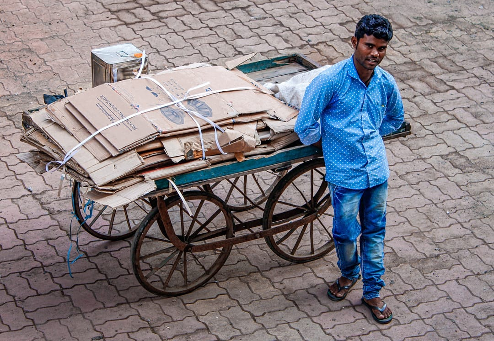

“ये जूना पुराना भंगार ये ख़ाली बाटली वाले”. ये शब्द सुनके बचपन में बड़ी ख़ुशी होती थी. कुछ दिनों से जमा किया हुआ कबाड़ लेके हम कबाड़ी वाले के पीछे भागते थे. कबाड़ी वाले से जो भी पैसे मिलते थे उससे बस खाने पीने के लिए कुछ मिल जाए उसी में ख़ुशी होती थी. अगर कबाड़ी वाले ने कुछ लिया नहीं तो थोड़ा दुःख भी होता था. पर ख़ुशी इस बात की होती थी के कुछ तो कबाड़ी वालेने लिया है और उसी ख़ुशी में पूरा दिन बिताया करते थे. आजकल तो सब होते हुए भी वो ख़ुशी नहीं मिल पाती. क्यूँ की हम छोटी छोटी चीजों में ख़ुशियाँ ढूँढना भूल गए है. जो मिला है उसमें खुश न होते हुए, जो चीज़ नहीं मिली उसी के दुःख में ख़ुशी को मनाना भूल जाते है. किसिने खूब कहा है अगर ख़्वाहिशों का बोझ ना होता तो ज़िंदगी बड़ी हसीन होतीं. इसलिए छोटी छोटी चीजों में ख़ुशियाँ ढूँढो, ज़िंदगी अपने आप खूबसूरत हो जाएगी।

###### Photo credits : https://gramho.com/profile/clickers_world_/6873502303
